# PS5 SMART COOLER

Общее руководство по прошивке, подключению и эксплуатации монитора температуры и оборотов вентилятора PS5 на базе ESP32-C3 mini.

Данное устройство предназначено для интеллектуального управления вентилятором охлаждения, а также для управления (понижения) напряжения питания APU вашей игровой консоли PlayStation 5. Оно подключается между штатным вентилятором консоли и материнской платой, обеспечивая мониторинг температуры и возможность гибкой настройки алгоритмов работы вентилятора через удобный веб-интерфейс.

**Автор: Walkman Life TV  
Соавтор: Tony (Repair-Fix)  
Редактор: FreeGen**

<a id="top"></a>
## СОДЕРЖАНИЕ

- [ВАЖНОЕ ПРЕДУПРЕЖДЕНИЕ](#warning)
  - [Установка и подключение](#warning-install)
  - [Прошивка ESP32 C3](#warning-firmware)
- [1. УСТАНОВКА ПРОШИВКИ](#01)
  - [1.1 Системные требования](#01-01)
  - [1.2 Подготовка](#01-02)
  - [1.3 Запуск и процесс установки](#01-03)
- [2. ПОДКЛЮЧЕНИЕ И НАСТРОЙКА](#02)
  - [2.1 Подготовка микроконтроллера](#02-01)
  - [2.2 Подключение к плате PS5](#02-02)
  - [2.3 Настройка контроллера](#02-03)
  - [2.4 Веб-интерфейс монитора](#02-04)
- [3. ИНСТРУКЦИЯ ПО ЭКСПЛУАТАЦИИ](#03)
  - [3.1 Главный экран](#03-01)
  - [3.2 Описание кольца индикации](#03-02)
  - [3.3 Режимы работы](#03-03)
    - [3.3.1 MANUAL (Ручной режим)](#03-03-01)
    - [3.3.2 OFFSET (Режим смещения)](#03-03-02)
    - [3.3.3 TARGET (Стабилизация температуры)](#03-03-03)
    - [3.3.4 GRAPH (Режим кривой)](#03-03-04)
  - [3.4 Редактор кривой (GRAPH EDITOR)](#03-04)
  - [3.5 Управление статистикой и графиком](#03-05)
  - [3.6 Верхние значки (системные настройки)](#03-06)
    - [3.6.1 Переключение темы](#03-06-01)
    - [3.6.2 Настройки Wi-Fi](#03-06-02)
    - [3.6.3 Индикатор I2C](#03-06-03)
    - [3.6.4 Advanced Settings (AS)](#03-06-04)
    - [3.6.5 Переключение режима управления (SC/PS5)](#03-06-05)
    - [3.6.6 Управление RGB-подсветкой](#03-06-06)
    - [3.6.7 Расширенный мониторинг (AM)](#03-06-07)
    - [3.6.8 Настройка напряжения процессора (Voltage Control)](#03-06-08)
  - [3.7 Управление RGB-подсветкой (подробно)](#03-07)
  - [3.8 Второй интерфейс управления (V2)](#03-08)
  - [3.9 Сброс и перезагрузка](#03-09)
  - [3.10 Техническая поддержка](#03-10)
- [4. ДОПОЛНИТЕЛЬНАЯ ПЛАТА](#04)
  - [4.1 Назначение платы](#04-01)
  - [4.2 Как установить плату на ESP32-C3 Mini](#04-02)
  - [4.3 Подключение датчика температуры и вентилятора](#04-03)
  - [4.4 Проверка перед включением](#04-04)
  - [4.5 Возможные проблемы и решения](#04-05)
  - [4.6 Заключение](#04-06)
- [5. ЧАСТО ЗАДАВАЕМЫЕ ВОПРОСЫ (FAQ)](#05)

## <a id="warning"> ВАЖНОЕ ПРЕДУПРЕЖДЕНИЕ

### <a id="warning-install"> Установка и подключение

**Установка и подключение устройства PS5 SMART COOLER требуют вмешательства во внутреннее устройство игровой консоли PlayStation 5.**

Данные работы **должны выполняться только квалифицированными специалистами**, имеющими опыт пайки, работы с электроникой и понимающими все связанные с этим риски (в том числе риск повреждения консоли, потери гарантии, короткого замыкания и т.д.).

**Автор (разработчик) данного программного и аппаратного обеспечения не несёт никакой ответственности** за любой прямой или косвенный ущерб, включая, но не ограничиваясь: выход из строя консоли, её компонентов, периферийного оборудования, потерю данных, возгорание или иные инциденты, возникшие в результате неправильной установки, настройки или использования устройства.

Пользуясь данным устройством, вы подтверждаете, что осознаёте все риски и принимаете их на себя.

### <a id="warning-firmware"> Прошивка ESP32 C3

**Внимание!** В процессе установки будут безвозвратно активированы аппаратные механизмы защиты, что сделает невозможным дальнейшую перепрошивку стандартными способами. Прошивка возможна только через предоставленный инсталлер при наличии лицензии для полной версии. Для бесплатной версии лицензия не требуется.

После сжигания eFuse `SPI_BOOT_CRYPT_CNT=1` загрузка возможна только с зашифрованного образа. Перепрошить плату стандартными средствами (например, через Arduino IDE или esptool без ключа) не получится.

Инсталлер использует уникальный для каждого устройства ключ активации, основанный на его ID. Ключ передаётся на плату после прошивки.

В случае сбоя питания во время записи eFuses плата может стать полностью неработоспособной. Следите за стабильностью подключения.
После успешной установки инсталлер можно удалить - он больше не потребуется.

**Автор (разработчик) данного программного и аппаратного обеспечения не несёт никакой ответственности** за любой прямой или косвенный ущерб, возникший в процессе прошивки! Пользуясь данным устройством, вы подтверждаете, что осознаёте все риски и принимаете их на себя.

Если у вас возникли вопросы или проблемы, обратитесь к разработчику, предоставив Device ID вашей платы (он отображается в первой строке после обнаружения: ✅ [ID: ...]).

Для прошивки микроконтроллера ESP32-C3 используется программа-инсталлер, предназначенная для записи защищённой прошивки PS5 Smart Cooler (обновление прошивки поддерживается).


## <a id="01"> 1. УСТАНОВКА ПРОШИВКИ

### <a id="01-01"> 1.1 Системные требования

- Компьютер с ОС Windows
- Один свободный USB-порт
- Плата **ESP32-C3 mini**
- Подключение к интернету (для проверки лицензии и загрузки прошивки)
- Установленные драйверы для USB-преобразователя

### <a id="01-02"> 1.2 Подготовка

1. Подключите ESP32-C3 к компьютеру с помощью USB-кабеля.  
   Убедитесь, что плата определяется системой (появился новый COM-порт в Windows). Другие устройства, использующие эмуляцию COM-порта, должны быть отключены на время прошивки.
2. Скачайте файл инсталлера (например, `installer.exe`) для Windows и поместите его в удобную папку.
3. **Важно:** инсталлер должен иметь доступ к интернету (разрешите в брандмауэре, если потребуется).

### <a id="01-03"> 1.3 Запуск и процесс установки

1. Подключите плату ESP32-C3 mini к USB.  
   *Если плата новая, ранее не прошивалась, переведите её в boot-режим: подключите USB, удерживая кнопку BOOT.*
2. Запустите инсталлер (возможно, потребуются права администратора / root для доступа к COM-порту).
3. На экране появится приветствие и начнётся поиск подключённой платы ESP32-C3.

Если плата не найдена, вы увидите сообщение об ошибке. Проверьте подключение и драйверы, затем повторите попытку.

4. После обнаружения платы программа считает её уникальный идентификатор (Device ID) и проверит наличие этого ID в удалённой базе данных (только для полной версии, в версии для мониторинга проверка лицензии не осуществляется).

   - Если ID есть в списке, отобразится сообщение **✅ ДОСТУП РАЗРЕШЕН**.
   - Если ID отсутствует, установка прервётся с сообщением **⛔️ ID ... НЕТ В БАЗЕ**. Обратитесь к поставщику устройства для добавления вашего ID в лицензионный список.

5. Затем инсталлер загрузит файл прошивки из интернета. При успехе вы увидите **✅ ГОТОВО** и размер файла.

6. Программа спросит подтверждение:
   Установить защищенную прошивку? (y/n):

   Нажмите **y** (латинская) и Enter, чтобы продолжить.

7. Начнётся процесс записи и настройки защиты:

   - Генерируется и записывается ключ шифрования.
   - Прошивка загружается в режиме Turbo Mode с повышенной скоростью (460800 бод).
   - После записи активируются защитные eFuses: отключается JTAG, включается загрузка только с шифрованного образа.
   - Все операции сопровождаются сообщениями о статусе. **Не отключайте питание и не закрывайте программу до появления финального сообщения об успехе.**

8. Финальный шаг - активация ключа. Инсталлер отправит сгенерированный ключ активации через последовательный порт.  
   Если всё пройдёт успешно, вы увидите **✅ УСПЕШНО**.

9. После завершения установки автоматически откроется монитор порта, где будут отображаться сообщения от прошивки.

```
BOOTING 
Initializing Hardware...
Device ID: ID:XXXXXXXXXXXX
✅ LICENSE_VERIFIED System Authorized.
Initializing Hardware...
📖 Settings loaded successfully!
📡 WiFi SSID: Keenetic-9622, Mode: 1 Mode: 2, Offset: 15 Connecting to 
Keenetic-9622...
System Ready (Hardware Sync)
✅ CONNECTED! IP: XXX.XXX.XXX.XXX 🔗 Link: http://ps5-test.local
МОНИТОР ПОРТА (Ctrl+C для выхода)
```

Вы можете наблюдать за работой устройства. Для выхода из монитора нажмите **Ctrl+C**.

**ВАЖНО!** При первой прошивке платы (плата новая, ранее не прошивалась) активация может пройти безуспешно, поскольку плата находится в режиме BOOT. В этом случае отключите плату от USB и снова подключите **без удерживания кнопки BOOT**, а затем презапустите инсталлер. Активация должна пройти успешно.


## <a id="02"> 2. ПОДКЛЮЧЕНИЕ И НАСТРОЙКА

### <a id="02-01"> 2.1 Подготовка микроконтроллера

Вам понадобится плата **ESP32-C3 Mini** (с поддержкой Wi-Fi и Bluetooth).

1. Скачайте установщик.
2. Подключите ESP32-C3 к компьютеру USB-кабелем.
3. Убедитесь, что плата определилась (в диспетчере устройств Windows появился новый COM-порт). На время прошивки отключите другие устройства, которые могут создавать виртуальные COM-порты.
4. Запустите скачанный установщик (может потребоваться запуск от имени администратора для доступа к COM-порту). Разрешите программе доступ в интернет в брандмауэре, если потребуется.
5. Установщик автоматически найдет подключенную плату ESP32-C3 и загрузит в неё необходимое ПО.

### <a id="02-02"> 2.2 Подключение к плате PS5

Припаяйте или прикрепите провода от ESP32-C3 к соответствующим точкам на материнской плате PlayStation 5 согласно таблице:

| GPIO | Куда подключать на PS5 | Описание |
|------|------------------------|-----------|
| **GPIO0** | SCL (вывод N11 чипсета, переходные отверстия на обратной стороне платы под чипсетом) | Линия тактирования I2C |
| **GPIO1** | SDA (вывод M11 чипсета, переходные отверстия на обратной стороне платы под чипсетом) | Линия данных I2C для считывания температуры |
| **GPIO6** | FAN_OUT_PIN (1-й контакт разъёма вентилятора, используется только в расширенной версии) | Выход сигнала PWM штатного вентилятора |
| **GPIO7** | FAN_IN_PIN (1-й контакт разъёма вентилятора на плате PS5) | Вход сигнала PWM штатного вентилятора |
| **5V** | 5V (с USB-разъема консоли или любая точка дежурного 5V на плате после предохранителя) | Питание ESP32-C3 |
| **GND** | GND (общий провод, например с USB-разъема) | Земля |
| **GPIO2** | PWM_DIAG_PIN (диагностический вывод, подключать не обязательно) | Вход для измерения высокого уровня ШИМ-сигнала на вентиляторе. Используется для диагностики: отображает напряжение в Advanced Settings. |
| **GPIO21** | RGB_PIN (выход для RGB-ленты) | Выход данных для адресной светодиодной ленты (WS2812/SK6812). Подключается к DIN ленты. Питание ленты берётся отдельно (5V). |

*Примечание: конкретные точки подключения SDA/SCL могут незначительно отличаться в разных ревизиях платы, но выводы чипсета M11 и N11 являются стандартными. Обвязка может различаться, но контактные площадки (переходные отверстия) сохраняются.*

*Точки подключения SDA/SCL для PS5 Pro на данный момент не определены и могут отличаться от стандартной версии. Информация будет добавлена позже.*

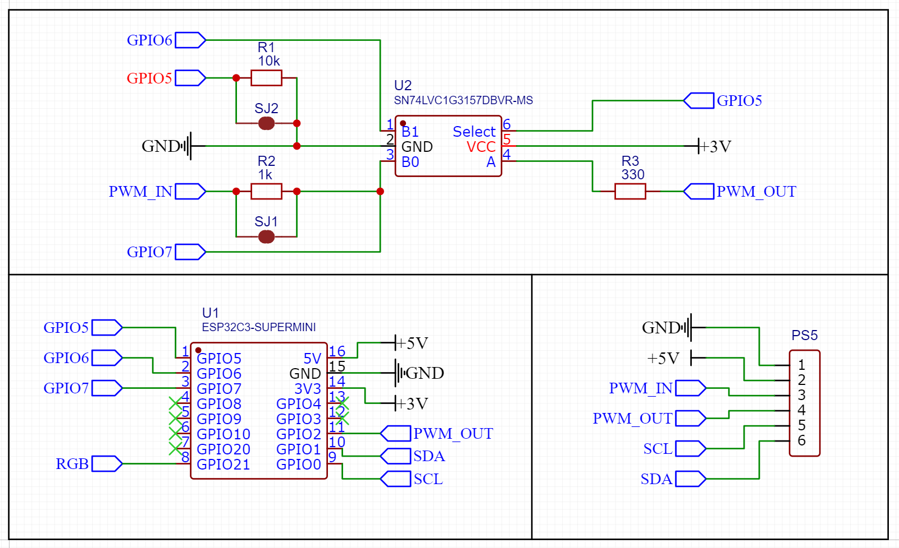

*Принципиальная схема устройства*


*Наглядная схема подключения*


*Точки подключения для Fat и Slim версий (залиты маской)*


*Точки подключения на Pro версиях*

### <a id="02-03"> 2.3 Настройка контроллера

После прошивки и подключения питания контроллер необходимо настроить для работы в вашей Wi-Fi сети.

1. При первом включении ESP32-C3 создаёт собственную точку доступа с именем `PS5_Smart_Cooler` (если он ещё не настроен на подключение к вашему роутеру).
2. Подключитесь к этой точке доступа со своего смартфона или ноутбука (пароль по умолчанию не требуется, если не был задан иной).
3. Откройте браузер и перейдите по адресу: **http://192.168.4.1**
4. В открывшемся интерфейсе выберите свою домашнюю Wi-Fi сеть и введите пароль. Контроллер перезагрузится и подключится к вашему роутеру.
5. Теперь для доступа к веб-интерфейсу монитора можно использовать IP-адрес, выданный роутером (узнайте его в списке клиентов DHCP роутера) или по имени хоста (например, `http://ps5-test.local`), если ваша сеть поддерживает mDNS.

### <a id="02-04"> 2.4 Веб-интерфейс монитора

После включения консоли PS5 откройте веб-интерфейс по IP-адресу ESP32-C3. На главном экране отображается:

- **Текущая температура** - большое значение в центре экрана (в °C).
- **INPUT (STOCK FAN SPEED)** - скорость, которую консоль задаёт штатному вентилятору (в процентах). Это сигнал ШИМ, идущий от консоли.
- **OUTPUT (BOOST FAN SPEED)** - скорость, которую устройство подаёт на вентилятор (отображается синим цветом). Изменение поддерживается только в полной версии прошивки.
- **Минимальная и максимальная температура** за время работы консоли - отображаются зелёным и красным индикаторами справа над графиком.
- **График истории** за последние 30 минут: синяя линия - температура, оранжевая - скорость вентилятора (в процентах).
- **Кнопки режимов** внизу: MANUAL, OFFSET, TARGET, GRAPH. Поддерживаются только в полной версии прошивки.
- **Кнопки управления статистикой:** AUTO-CLEAR STATS, RESET STATS - позволяют автоматически сбрасывать статистику или сбросить её вручную.


## <a id="03"> 3. ИНСТРУКЦИЯ ПО ЭКСПЛУАТАЦИИ

### <a id="03-01"> 3.1 Главный экран

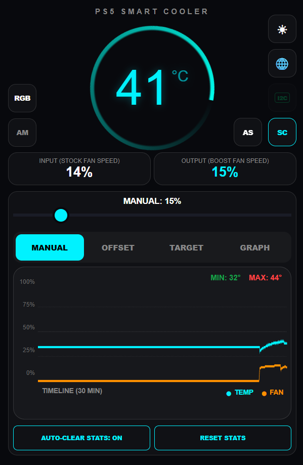

На главном экране отображается:
- **Текущая температура** (°C) - крупное значение в центре.
- **INPUT (STOCK FAN SPEED)** - скорость вращения штатного вентилятора (ШИМ-сигнал от консоли), %.
- **OUTPUT (BOOST FAN SPEED)** - скорость, которую устройство подаёт на вентилятор (%, синий цвет).
- **Минимальная и максимальная температура** за время работы консоли (зелёный и красный индикаторы справа над графиком).
- **График истории** за последние 30 минут (синяя линия - температура, оранжевая - скорость вентилятора).
- **Кнопки режимов** внизу: MANUAL, OFFSET, TARGET, GRAPH.
- **Кнопки управления статистикой**: AUTO-CLEAR STATS, RESET STATS.

В правом верхнем углу расположены служебные значки (подробнее в разделе 3.6).

### <a id="03-02"> 3.2 Описание кольца индикации

На главном экране вокруг крупного значения температуры расположено **вращающееся кольцо** (элемент с эффектом «ауры»). Оно выполняет две функции:

- **Цвет кольца** меняется в зависимости от текущей температуры консоли:
  - При температуре **до 40°C** кольцо имеет голубовато‑бирюзовый оттенок.
  - При повышении температуры выше 40°C оттенок плавно смещается к красному: каждые 4°C сверх 40 уменьшают угол цветового тона (hue), делая цвет теплее.
  - Максимальное покраснение достигается при высоких температурах (около 85°C и выше).

- **Скорость вращения** кольца прямо пропорциональна текущей скорости вентилятора (OUTPUT):
  - Когда вентилятор неподвижен - кольцо не вращается и становится полупрозрачным.
  - При увеличении оборотов кольцо начинает вращаться быстрее, визуально отображая интенсивность охлаждения.
  - Вращение всегда плавное, с инерцией, чтобы не создавать резких движений.

Это кольцо позволяет оценить тепловое состояние консоли и работу вентилятора, даже не глядя на цифры. Если консоль выключена или датчик температуры недоступен, кольцо становится бледным и останавливается.

*Примечание: данная анимация реализована программно и не влияет на реальную работу системы охлаждения, а служит лишь для удобства визуального контроля.*

### <a id="03-03"> 3.3 Режимы работы (доступны в платной версии)

Устройство поддерживает четыре режима управления вентилятором. Выбор режима осуществляется соответствующими кнопками под графиком.

#### <a id="03-03-01"> 3.3.1 MANUAL (Ручной режим)


В этом режиме вы сами задаёте скорость вентилятора в процентах.
- Ползунок под надписью MANUAL: XX% позволяет установить нужное значение от 0 до 100%.
- Устройство будет удерживать заданную скорость независимо от температуры.

#### <a id="03-03-02"> 3.3.2 OFFSET (Режим смещения)


Устройство берёт за основу скорость, заданную штатным управлением консоли (INPUT), и прибавляет к ней фиксированное значение (OFFSET).

- Ползунком регулируется величина смещения (от 0 до 50%).
- Итоговая скорость = INPUT + OFFSET (ограничивается 100%).
- *Примечание*: если датчик температуры не работает, в этом режиме можно принудительно игнорировать его (см. раздел 3.6.3 - значок I2C).


#### <a id="03-03-03"> 3.3.3 TARGET (Стабилизация температуры)


Устройство пытается удержать температуру консоли на заданном целевом значении, динамически изменяя скорость вентилятора.

- Ползунком устанавливается целевая температура (TARGET, от 30 до 90°C).
- Алгоритм содержит пропорциональную и интегральную составляющие, а также предварительный нагрев (pre‑heat).
- **Sensitivity (K)** - коэффициент усиления пропорциональной составляющей (настраивается в Advanced Settings). Чем выше значение, тем агрессивнее реакция на превышение температуры.
- **Smooth** - коэффициент фильтрации выходного сигнала (чем выше, тем плавнее изменения).

#### <a id="03-03-04"> 3.3.4 GRAPH (Режим кривой)

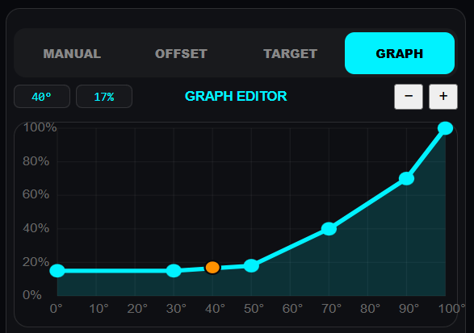

Позволяет задать произвольную зависимость скорости вентилятора от температуры с помощью графика-редактора.

- При переходе в этот режим вместо ползунка появляется поле **GRAPH EDITOR** с координатной сеткой и точками.
- Доступно от 2 до 10 опорных точек.
- Точки можно перемещать пальцем или мышью (подробнее в разделе 3.4).

### <a id="03-04"> 3.4 Редактор кривой (GRAPH EDITOR)

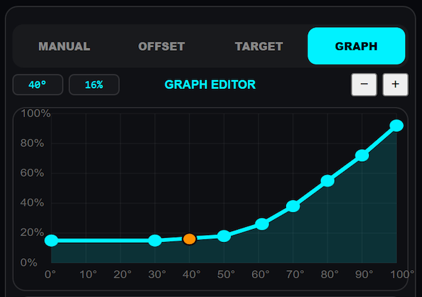

- **Сетка**: по горизонтали - температура (°C), по вертикали - скорость вентилятора (%).
- **Синяя линия** - построенная по точкам кривая.
- **Оранжевая точка** - текущее состояние (текущая температура / текущая скорость).
- **Действия**:
  - **Перемещение точки**: коснитесь и перетащите любой синий кружок. При перемещении отображаются текущие координаты (температура, скорость) в верхней части редактора.
  - **Добавление точки**: нажмите кнопку **«+»** справа вверху (максимум 10 точек).
  - **Удаление точки**: нажмите кнопку **«−»** (минимум 2 точки).
  - **Автоматические ограничения**: температура каждой следующей точки должна быть больше предыдущей (по X), скорость может как расти, так и падать, но в пределах от 0 до 100%.

Все изменения сохраняются автоматически после отпускания точки.

### <a id="03-05"> 3.5 Управление статистикой и графиком

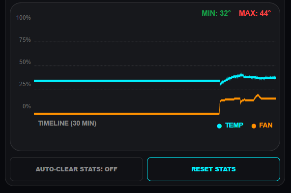

- **AUTO-CLEAR STATS** (кнопка внизу слева): если включено (синий цвет), при выключении консоли статистика (min/max температура и история) автоматически сбрасывается. Полезно для каждого нового сеанса.
- **RESET STATS** (кнопка справа): ручной сброс статистики и очистка графика.

График истории отображает последние 30 минут работы. Шкала времени равномерная, ось Y - температура (до 100°C) и скорость вентилятора (до 100%). Синяя линия - температура, оранжевая - скорость.

### <a id="03-06"> 3.6 Верхние значки (системные настройки)

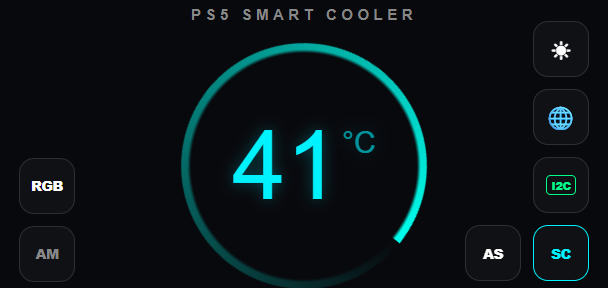

В правом верхнем углу расположены пять значков (в платной версии их больше – добавляются AS и SC). В бесплатной мониторинговой версии доступны только переключение темы, Wi-Fi, I2C и иногда RGB (см. ниже).

#### <a id="03-06-01"> 3.6.1 Переключение темы

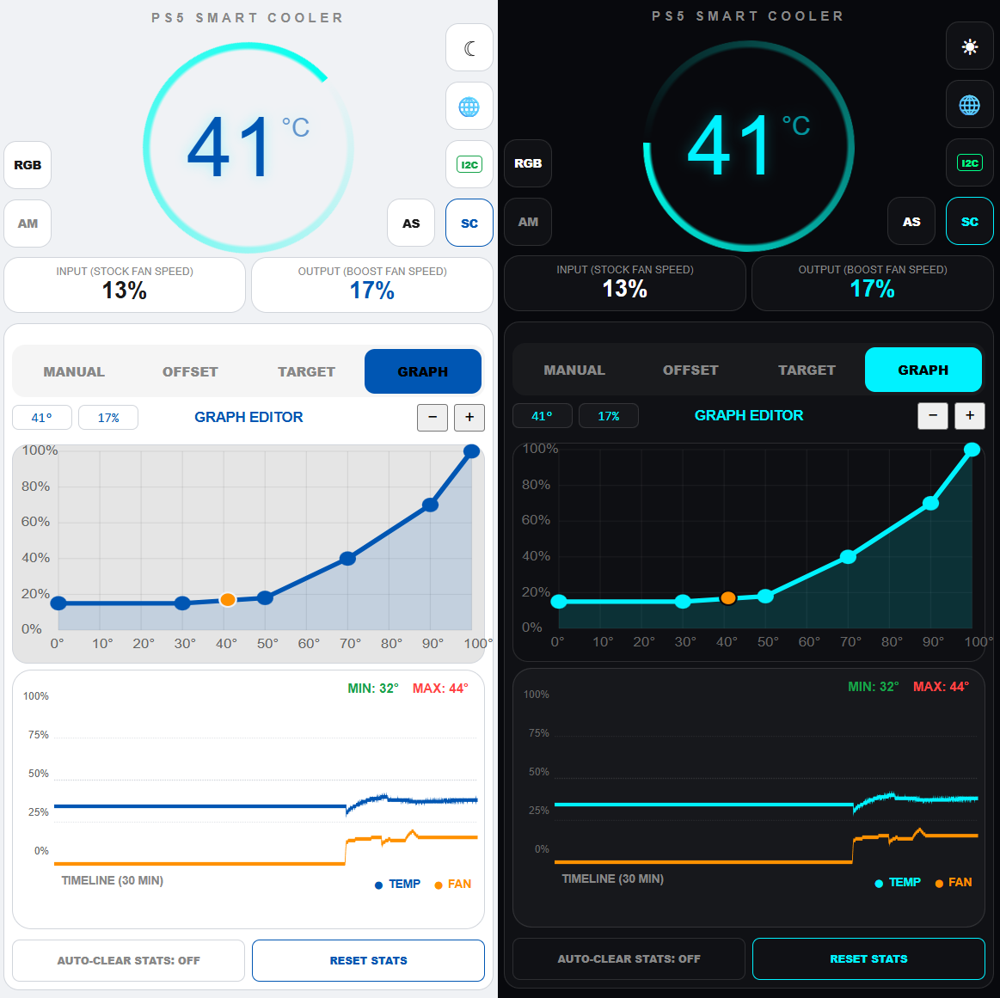

Меняет цветовую схему интерфейса между светлой и тёмной. Выбор сохраняется в памяти устройства.

#### <a id="03-06-02"> 3.6.2 Настройки Wi-Fi


Открывает модальное окно **NETWORK SETTINGS**:

- **Device Name (.local)** - имя хоста в локальной сети (mDNS). Может содержать максимум 15 символов. Можно использовать любое уникальное имя, например: 
`http://custom-name.local`.
- **Access Point Name** - имя сети Wi-Fi (SSID):
  - Если включён режим **"Connect to home router"** (галочка внизу) - это имя вашего домашнего роутера, к которому устройство попытается подключиться.
  - Если режим выключен - устройство создаст собственную точку доступа с указанным именем.
- **Password** - пароль сети (минимум 8 символов, для точки доступа можно оставить пустым - открытая сеть).
- **Confirm Password** - подтверждение пароля.
- **APPLY & REBOOT** - сохранить настройки и перезагрузить контроллер.
- **RESET WI-FI TO DEFAULT** - сброс Wi-Fi к заводским настройкам (режим точки доступа с именем `PS5_Smart_Cooler`, без пароля).

#### <a id="03-06-03"> 3.6.3 Индикатор I2C


Показывает состояние датчика температуры, подключённого к шине I2C:

- **Зелёный** - датчик работает, данные актуальны.
- **Красный** - связь с датчиком потеряна.
- **Перечёркнутый** - режим игнорирования ошибки I2C (включён пользователем).

**Нажатие на значок** переключает режим игнорирования ошибок датчика. Это полезно, например, в режиме OFFSET, когда вы хотите управлять вентилятором без учёта температуры (упрощённая установка, без физического подключения к шине I2C). При активном игнорировании отображается `--°C` на главном экране, а управление происходит по штатному сигналу консоли.

#### <a id="03-06-04"> 3.6.4 Advanced Settings (AS)

 

Открывает панель **ADVANCED SETTINGS** с дополнительными параметрами:

- **Sensitivity (Response Speed)** - коэффициент K.  Диапазон: 0.1 ... 2.0 (значение K/10). Влияет на скорость реакции при отклонении температуры от целевой.
  **Sensitivity (K)** определяет, насколько сильно увеличивается скорость вентилятора при превышении целевой температуры. Например, при K=1.0 и отклонении на +1°C скорость может вырасти примерно на ~8% (с учётом интегральной составляющей). Высокий K обеспечивает быстрое охлаждение, но возможны перерегулирования.
- **Smooth (Data Filter)** - коэффициент фильтрации выходного сигнала. Фактическое значение: 0.001 ... 0.050 (ползунок 1–50).  
  Сглаживает резкие изменения скорости вентилятора: чем выше значение, тем медленнее и плавнее происходят изменения. Значение 0.008 (по умолчанию) даёт умеренную плавность, при увеличении до 0.05 изменения становятся очень медленными, снижая шум и нагрузку.
- **REBOOT CONTROLLER** - перезагрузка устройства.
- **RESET ALL TO DEFAULT** - сброс всех настроек (режимы, кривая, параметры Wi-Fi) к заводским значениям. Устройство перезагрузится.
- **FW version** - версия прошивки.

> **Примечание:** в платной версии в этом же меню доступны расширенные настройки напряжения процессора (Voltage Control) и прямой доступ к регистрам PMBus. Эти функции предназначены для опытных пользователей и требуют ввода PIN-кода, Подробнее см. в документации.

#### <a id="03-06-05"> 3.6.5 Переключение режима управления (SC/PS5)


Кнопка с надписью **SC** или **PS5**:

- **SC (Smart Cooler)** - устройство активно управляет вентилятором согласно выбранному режиму (синий цвет).
- **PS5** - режим прозрачного мониторинга: устройство пропускает штатный сигнал консоли напрямую к вентилятору, но продолжает отображать температуру и статистику. Выходная скорость повторяет входную (благодаря дополнительному мультиплексору происходит именно физическое переключение сигналов, а не имитация внутри устройства).

#### <a id="03-06-06"> 3.6.6 Управление RGB-подсветкой (новое)


> **Подключение RGB-ленты:** используйте вывод **GPIO21** для данных (DIN), питание 5V и GND – от внешнего источника или от USB ESP32 (если ток ленты не превышает 500 мА). Не подключайте мощные ленты напрямую к пину 5V ESP32 – используйте внешний стабилизатор.

В левом верхнем углу экрана появилась кнопка **RGB** (иконка светодиода). При нажатии открывается модальное окно настройки цветной светодиодной ленты, подключённой к пину `RGB_PIN` (по умолчанию GPIO21). В окне доступны следующие параметры:

- **Enable** – включить/выключить подсветку.
- **LEDs count** – количество светодиодов в ленте (от 1 до 20). Изменяется кнопками «−» и «+».
- **Brightness** – общая яркость (0–255).
- **Smoothness** – скорость плавного перехода между цветами (0–100). Чем выше значение, тем медленнее меняется цвет.
- **Temperature stability** – степень сглаживания показаний температуры для RGB (0–100). Помогает избежать резких скачков цвета при кратковременных колебаниях температуры.
- **Red/Green/Blue correction** – индивидуальная калибровка цветовых каналов (0.00–1.00). Позволяет компенсировать особенности конкретной ленты.
- **Mode** – выбор режима работы:
  - **Ring** – цвет меняется от голубого к красному в зависимости от температуры (аналог кольца на главном экране).
  - **Temperature** – цвет выбирается по заданной таблице «температура → цвет» (резкое переключение).
  - **Temperature smooth** – то же, но с плавной интерполяцией между соседними точками.
  - **Aura** – бегущая радуга (не зависит от температуры).
- **Test running light** – кнопка, включающая тестовый режим (последовательное зажигание цветов) для проверки работоспособности ленты.
- **White** – временно включает белый цвет на ленте (полезно для проверки яркости и калибровки).
- **Temp → Color map** – таблица соответствия температуры и цвета (до 20 точек). Для каждой точки задаётся температура (°C) и цвет (выбирается ползунком Hue). Точки можно добавлять, удалять и перетаскивать.


Все настройки сохраняются в EEPROM и применяются автоматически.

#### <a id="03-06-07"> 3.6.7 Расширенный мониторинг (AM)

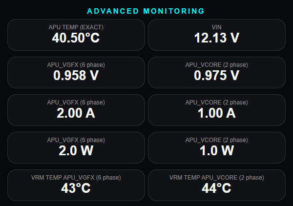

Рядом с кнопкой RGB находится кнопка **AM** (Advanced Monitoring). При нажатии открывается панель с дополнительной телеметрией, считываемой по шине PMBus от контроллера питания процессора PS5 (доступно только в платной версии и при подключении I2C к чипсету). На панели отображаются:

- **APU TEMP (EXACT)** – точная температура APU с дробной частью.
- **VIN** – входное напряжение питания.
- **APU_VGFX (6 phase)** – напряжение, ток и мощность для графического ядра (VGFX).
- **APU_VCORE (2 phase)** – напряжение, ток и мощность для вычислительных ядер (VCORE).
- **VRM TEMP APU_VGFX / APU_VCORE** – температуры соответствующих VRM-цепей.

Данные обновляются раз в секунду, когда консоль включена и прошло не менее 5 секунд после включения.

#### <a id="03-06-08"> 3.6.8 Настройка напряжения процессора (Voltage Control) для полной версии

**Внимание! Этот раздел предназначен только для опытных пользователей!**  
Неправильное изменение напряжений может привести к нестабильной работе, перегреву или **повреждению процессора PS5** и других компонентов консоли. Все изменения вы делаете на свой страх и риск. Автор не несёт ответственности за любой ущерб.

##### Доступ к настройкам

1. Откройте панель **ADVANCED SETTINGS** (значок `AS` в правом верхнем углу).
2. В разделе **DEVICE INFO** найдите поле для ввода **PIN-кода**.
   - PIN-код состоит из 4 цифр ID платы.
   - Он формируется из последних 4 символов MAC-адреса вашей платы ESP32-C3 и уникален для каждого устройства.
3. Нажмите на поле ввода – появится предупреждение о рисках. После его принятия вы сможете ввести PIN.
4. Введите 4-значный PIN и нажмите **Unlock**. Если PIN верный, откроются блоки **VOLTAGE CONTROL**, **AUTO-LOAD VOLTAGE SETTINGS** и **PMBUS DIRECT ACCESS**.

##### Интерфейс Voltage Control


Панель **VOLTAGE CONTROL** позволяет считывать и изменять напряжения, подаваемые на процессор PS5 через PMBus-контроллер (чип Infineon). Доступны две страницы:

- **APU_VGFX (6 phase)** – напряжение для графического ядра (обычно ~0.8–1.2 В).
- **APU_VCORE (2 phase)** – напряжение для вычислительных ядер (обычно ~0.8–1.2 В).

Для каждой страницы можно управлять четырьмя регистрами:

| Регистр | Адрес (hex) | Описание |
|------|------------------------|-----------|
| VOUT_COMMAND | 0x21 | Основное напряжение, которое контроллер подаёт на процессор. |
| VOUT_MAX | 0x24 | Максимально допустимое напряжение (ограничение). |
| VOUT_MARGIN_HIGH | 0x25 | Напряжение для режима «высокий запас» (обычно не используется). |
| VOUT_MARGIN_LOW  | 0x26 | Напряжение для режима «низкий запас» (обычно не используется). |

Для каждого регистра вы можете:

- **Выбрать значение** из выпадающего списка – значения представлены в формате VID (шестнадцатеричный код) и соответствующем напряжении в вольтах (например, `0x8C (1.150 V)`).
- **Применить выбранное значение немедленно** – кнопка ▶ (треугольник) применяет напряжение только для этого регистра.
- **Сохранить выбранное значение в EEPROM** – кнопка 💾 запоминает VID для этого регистра (без немедленного применения). Сохранённые значения будут использоваться при автоматической загрузке.

**Важное замечание для владельцев PS5 Slim (и поздних ревизий):**  
На консолях PS5 Slim (а также на некоторых ревизиях с обновлённым PMBus-контроллером) для успешного изменения напряжения через регистры VOUT_COMMAND необходимо **предварительно установить регистр VOUT_MAX** (0x24) для соответствующей страницы (APU_VGFX или APU_VCORE). Без корректного значения VOUT_MAX контроллер питания блокирует запись в другие регистры напряжения.

**Порядок действий для Slim:**  
1. Установите VOUT_MAX **заведомо большее** (или равное) желаемому напряжению (например 1.200В).  
2. Затем изменяйте VOUT_COMMAND (и другие регистры) на нужные значения.  
3. Если вы используете кнопку **Apply All**, она применит регистры в порядке: VOUT_MAX, VOUT_COMMAND, VOUT_MARGIN_HIGH, VOUT_MARGIN_LOW – что корректно для Slim.

##### Кнопки массового применения и сохранения

- **Apply All** – применяет все четыре регистра для выбранной страницы (сразу на всё процессорное напряжение).
- **Save all registers for this page** – сохраняет текущие значения всех четырёх регистров для выбранной страницы в EEPROM.

##### Автоматическая загрузка сохранённых напряжений


Включите опцию **Auto-load saved voltage after PS5 starts**, и устройство будет автоматически применять сохранённые вами напряжения каждый раз при включении консоли. Дополнительные настройки:

- **Delay after PS5 start (seconds)** – задержка перед применением (от 0 до 60 секунд). Нужна, чтобы консоль успела стабилизироваться после включения.
- **Require I2C activity (temperature sensor) before applying** – если включено, то напряжения будут применены только после того, как датчик температуры начнёт передавать данные (это гарантирует, что шина I2C работает и консоль загрузилась).
- **Registers to auto-apply (per page)** – флажки для каждого регистра, позволяющие выбрать, какие именно регистры должны автоматически применяться (можно исключить ненужные).

##### Прямой доступ к PMBus (PMBUS DIRECT ACCESS)

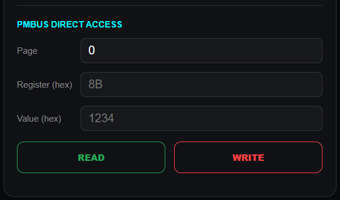

Для продвинутых пользователей доступен ручной ввод команд чтения/записи любых PMBus-регистров.

- Укажите **Page** (0 или 1), **Register** (шестнадцатеричный адрес, например `8B`) и **Value** (шестнадцатеричное значение для записи).
- Нажмите **Read** – результат будет отображён в поле результата.
- Нажмите **Write** – значение будет записано в указанный регистр.

**Внимание!** Неправильное использование прямого доступа может вывести консоль из строя. Используйте только если вы точно знаете, что делаете, и ознакомились с документацией на PMBus-контроллер Infineon.

##### Сохранённые значения

В нижней части панели отображаются текущие сохранённые VID для всех регистров обеих страниц – это полезно для контроля и отладки.

##### Рекомендации по безопасной настройке

1. Никогда не изменяйте напряжение более чем на ±5–10% от заводского значения.
2. Проверяйте стабильность работы консоли в стресс-тестах (например, в играх) после каждого изменения.
3. Если консоль перестала запускаться или работает нестабильно, снимите галочку "Auto-load saved voltage after PS5 starts" и перезапустите консоль.
4. Для восстановления заводских настроек используйте кнопку **RESET ALL TO DEFAULT** в панели AS – она сбросит все сохранённые VID, а также другие настройки.

> **Примечание:** все изменения, сделанные через Apply, действуют только до перезагрузки консоли или отключения питания. Чтобы они применялись автоматически при каждом включении, обязательно включите опцию Auto-load и настройте задержку и маски.

### 6.9 Диагностика уровня PWM-сигнала

Устройство оснащено встроенной функцией диагностики уровня сигнала ШИМ (PWM) на выходе вентилятора. Это позволяет быстро проверить, корректно ли формируется управляющий сигнал и достаточен ли его уровень напряжения.

**Как работает диагностика:**
- С помощью АЦП измеряется напряжение на выводе `PWM_DIAG_PIN` (GPIO2) в моменты, когда ШИМ-сигнал находится в высоком состоянии (HIGH).
- Измерения производятся раз в секунду и отображаются в панели **ADVANCED SETTINGS** (значок `AS`) в строке **PWM High Level** (напряжение в вольтах).
- Рядом с напряжением выводится статус:
  - **✅ OK** – если напряжение выше 2.5 В (сигнал нормальный).
  - **❌ LOW** – если напряжение ниже 2.5 В (проблема с питанием, обрыв цепи или повреждение вывода микроконтроллера).

**Где смотреть:**
1. Откройте веб-интерфейс устройства.
2. Нажмите на значок `AS` (Advanced Settings) в правом верхнем углу.
3. Пролистайте вниз до строк **PWM High Level** и **PWM Status**.

**Интерпретация результатов:**
- **Норма:** `PWM High Level: 2.8–3.3 V`, статус `✅ OK`. Это означает, что управляющий сигнал имеет достаточную амплитуду и вентилятор должен корректно работать.
- **Предупреждение:** `PWM High Level: 2.0–2.5 V`, статус может быть `✅ OK` или `❌ LOW` в зависимости от порога. Рекомендуется проверить питание ESP32-C3 (должно быть стабильное 5 В) и качество пайки выводов.
- **Ошибка:** `PWM High Level: < 2.0 V`, статус `❌ LOW`. Это указывает на низкий уровень сигнала, что может привести к нестабильной работе вентилятора или его остановке. Проверьте:
  - Питание ESP32-C3 (напряжение на выводе 5V должно быть не менее 4.8 В).
  - Исправность цепей управления (GPIO6 – выход PWM, GPIO7 – вход PWM).
  - Отсутствие короткого замыкания на землю или на питание.
  - Возможно, повреждён выходной каскад (транзистор или MOSFET на дополнительной плате).

**Примечание:** Диагностика доступна только в платной версии прошивки (при активированной лицензии). В бесплатной мониторинговой версии эта функция отключена или не отображается.

### <a id="03-07"> 3.7 Управление RGB-подсветкой (подробно)

(См. пункт 3.6.6, но для удобства вынесено в отдельный раздел.)

Чтобы открыть окно настройки RGB, нажмите на значок светодиода в левом верхнем углу главного экрана. Все изменения применяются в реальном времени.

**Рекомендации по настройке:**
- Для обычной индикации нагрева используйте режим **Ring** – он интуитивно понятен.
- Если у вас есть конкретные цветовые предпочтения, создайте таблицу в режиме **Temperature smooth**.
- Для праздничного эффекта включите **Aura**.
- Перед калибровкой цветов убедитесь, что лента правильно подключена и питание соответствует её характеристикам.

### <a id="03-08"> 3.8 Второй интерфейс управления (V2)

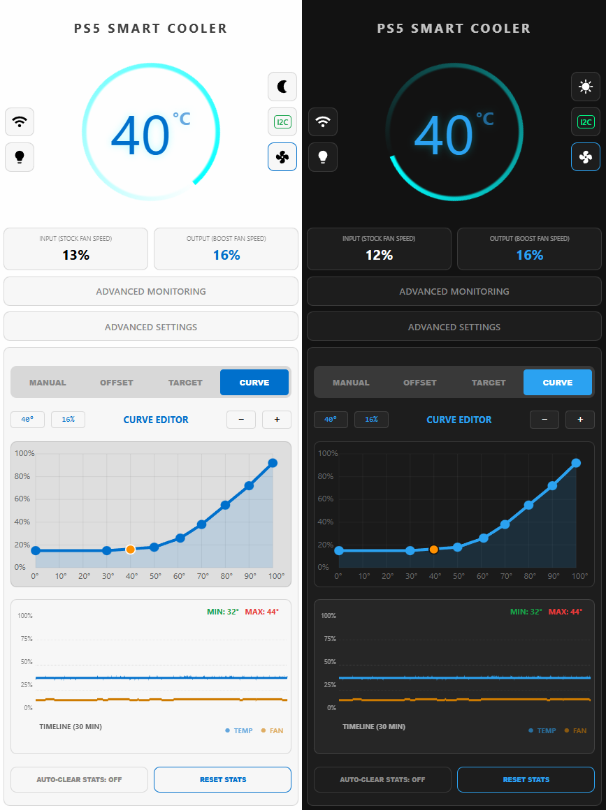

Помимо классического интерфейса, устройство поддерживает **альтернативный веб-интерфейс** с улучшенным дизайном, адаптированным для мобильных устройств. Он содержит те же функции, но в более современном и компактном виде.

**Как переключиться:**
- Откройте в браузере адрес: `http://<IP-адрес-ESP>/v2` (например, `http://192.168.1.100/v2` или `http://ps5-test.local/v2`).
- Или просто добавьте `/v2` к основному адресу.

**Особенности V2:**
- Увеличенные элементы управления, удобные для пальцев.
- Иконки вместо текста для часто используемых действий.
- Поддержка PWA (можно установить как приложение на телефон).
- Та же функциональность, что и в основной версии: все режимы, график, настройки Wi-Fi, RGB, AM, AS и т.д.

Вы можете пользоваться любым интерфейсом по своему усмотрению – оба синхронизируют настройки.

### <a id="03-09"> 3.9 Сброс и перезагрузка

- **Через интерфейс**: используйте кнопки в Advanced Settings (`REBOOT` / `RESET ALL TO DEFAULT`).
- **Аппаратный сброс**: если устройство перестало отвечать, можно перезагрузить его отключением питания консоли на 10 секунд.

### <a id="03-10"> 3.10 Техническая поддержка

В случае возникновения вопросов обращайтесь к документации на сайте производителя или в официальный Telegram‑канал.


## <a id="04"> 4. ДОПОЛНИТЕЛЬНАЯ ПЛАТА

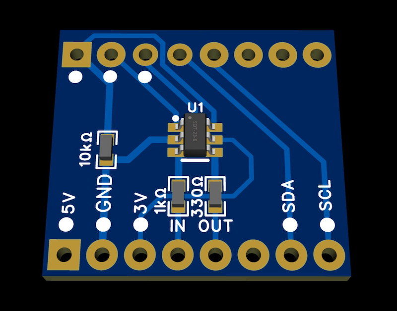

### <a id="04-01"> 4.1 Назначение платы

Обозначения пинов:
- **5V, 3V, GND** - линии питания.
- **SDA, SCL** - шина I2C.
- **IN, OUT** - вход и выход сигнала для управления вентилятором или байпасом.

**Мультиплексирование PWM** - для переключения управления вентилятором между консолью и PS5 Smart Cooler.

### <a id="04-02"> 4.2 Как установить плату на ESP32-C3 Mini

Плата представлена в виде расширения для ESP32-C3 Mini. Вам необходимо совместить контакты отмеченные шелкографией.

- **5V** - питание от внешнего источника
- **GND** - общий провод (земля)
- **3V** - питание логики ESP32-C3 Mini
- **SDA** - линия данных I2C
- **SCL** - линия тактирования I2C
- **GPIO5** - дополнительный управляющий сигнал
- **GPIO6** - выход сигнала PWM штатного вентилятора
- **GPIO7** - Вход сигнала PWM штатного вентилятора

Все остальные пины не используются и подключать их не требуется.

#### Важно
- Перед пайкой убедитесь в правильной ориентации платы.
- Не допускайте короткого замыкания между линиями питания и сигнальными пинами.
- После установки рекомендуется проверить соединения мультиметром.

#### Основные сигналы ESP32-C3 Mini, используемые в проекте:

- **GPIO5** - BYPASS_PIN (управление байпасом)
- **GPIO7** - FAN_IN_PIN (вход с датчика Холла/вентилятора)
- **GPIO6** - FAN_OUT_PIN (ШИМ на вентилятор)
- **GPIO8** - I2C_SDA
- **GPIO9** - I2C_SCL
- **Питание**: 5V и 3.3V, GND.

### <a id="04-03"> 4.3 Подключение датчика температуры и вентилятора через плату

#### Датчик температуры
- Датчик находится внутри процессора, его выводы **SDA** и **SCL** должны быть подключены к соответствующим линиям на плате, которые попадают на GPIO0 и GPIO1 ESP32.

#### Управление вентилятором
- **IN** - сигнал от южного моста (ШИМ). Он должен быть подан на GPIO7 (FAN_IN_PIN). На плате может быть входной разъём для подключения провода от консоли.
- **OUT** - сигнал на внешний вентилятор (ШИМ). Идёт от GPIO6.
- **BYPASS_PIN** - на плате есть переключатель, который управляется GPIO5 и переключает сигнал между входом и выходом.

### <a id="04-04"> 4.4 Проверка перед включением

1. Совместите платы - вставьте ESP32-C3 Mini в разъём дополнительной платы строго по ориентации.

2. **Проверьте целостность соединений** - убедитесь, что пины питания (5V, 3V3, GND) не закорочены.

3. **Подключите внешние компоненты**:
   - **a.** Датчик температуры к клеммам SDA/SCL/5V/GND на плате.
   - **b.** Вход от консоли (сигнал вентилятора) к контакту IN.
   - **c.** Выход на усилитель/вентилятор к контакту OUT.

4. **Подайте питание** - через USB или от консоли (5 В). Контроллер запустится.

### <a id="04-05"> 4.5 Возможные проблемы и решения

| Проблема | Возможная причина | Решение |
|------|------------------------|-----------|
| **I2C не работает** | Неверный уровень напряжения (нужно 3.3 В), отсутствие подтягивающих резисторов, перепутаны дата-линии, неверное подключение | Проверьте уровни напряжений на SDA/SCL (должны быть 3.3 В после преобразования). Убедитесь в наличии подтяжки. Проверить правильность подключения дата-линий. |
| **Вентилятор не вращается** | Нет ШИМ-сигнала с GPIO6, байпасный ключ не переключён, плохой контакт | Проверьте осциллографом или мультиметром в режиме частоты, идёт ли ШИМ с GPIO6. Убедитесь, что BYPASS_PIN (GPIO5) установлен в HIGH в активном режиме SC. Проверьте пайку контактов IN/OUT. |
| **Плата не загружается после установки мультиплексора** | Короткое замыкание, перепутаны пины питания | Отключите питание, проверьте все соединения. Убедитесь, что 5V и 3V3 нигде не замкнуты. Попробуйте запустить ESP32-C3 отдельно (без мультиплексора). |
| **Wi-Fi не работает** | Помехи от металлического корпуса, недостаточное питание | Вынесите антенну ESP32-C3 ближе к отверстию консоли или пластиковой части корпуса. Используйте стабильное питание 5V (не менее 500 мА). |
| **Плата не найдена** | Не установлены драйверы, некачественный кабель, занят порт | Установите драйверы, попробуйте другой кабель, перезапустите инсталлер |
| **Ошибка подключения к серверу** | Нет интернета, блокировка брандмауэром | Проверьте интернет-соединение, отключите VPN/прокси, добавьте инсталлер в исключения брандмауэра |
| **ID не в базе** | Устройство не лицензировано | Свяжитесь с разработчиком для добавления вашего ID в список |
| **Ошибка записи / сбой во время прошивки** | Плохой контакт USB, сбой питания | Повторно подключите плату, перезапустите инсталлер. Если ошибка повторяется, возможно, плата неисправна |
| **После прошивки плата не работает** | Неверный ключ активации или сбой при сжигании eFuses | Попробуйте перезапустить питание платы. Обратитесь в поддержку |

### <a id="04-06"> 4.6 Заключение

ДОПОЛНИТЕЛЬНАЯ ПЛАТА предназначена для удобного подключения датчика и вентилятора к ESP32-C3 Mini, обеспечивая коммутацию сигналов. Следуя описанным шагам, вы сможете правильно смонтировать её и запустить систему мониторинга и управления вентилятором PS5.

Если остались вопросы - уточните назначение каждого пина на вашей плате (например, пришлите фото или схему с пояснениями), и мы поможем детальнее.


## <a id="05"> 5. ЧАСТО ЗАДАВАЕМЫЕ ВОПРОСЫ (FAQ)

**Вопрос:** Можно ли использовать ESP32-C3 без мультиплексора?  
**Ответ:** Да, для режима мониторинга (только чтение температуры и скорости) мультиплексор не нужен. Однако для полноценного управления вентилятором с возможностью байпаса требуется дополнительная плата с коммутацией PWM.

**Вопрос:** Что делать, если после прошивки плата не создаёт точку доступа Wi-Fi?  
**Ответ:** Попробуйте перепрошить плату с помощью инсталлера, подключить плату к источнику питания другим кабелем, либо изменить источник питания на другой. Так же проверьте логи через монитор порта.

**Вопрос:** Будет ли работать управление вентилятором в бесплатной версии?  
**Ответ:** Нет. Бесплатная версия предназначена только для мониторинга. Управление (MANUAL, OFFSET, TARGET, GRAPH) доступно только в платной лицензионной прошивке.

**Вопрос:** Как обновить прошивку после установки?  
**Ответ:** Обновление поддерживается через тот же инсталлер (будет выпущена новая версия). Плата уже защищена eFuse, но инсталлер может загружать обновлённые образы с сохранением защиты.

**Вопрос:** Можно ли вернуть плату в исходное состояние?  
**Ответ:** Нет, процесс сжигания eFuse необратим. Вы всегда сможете загружать только официальные прошивки, подписанные ключом разработчика.

**Вопрос:** Как подключить RGB-ленту и где взять питание?  
**Ответ:** Подключите ленту к пину `RGB_PIN` (по умолчанию GPIO21) и к питанию 5V и GND. Убедитесь, что общий ток не превышает возможностей источника питания ESP32 (рекомендуется внешний источник 5V для мощных лент).

**Вопрос:** Где найти второй интерфейс V2?  
**Ответ:** Просто добавьте `/v2` к адресу вашего устройства, например: `http://192.168.1.100/v2` или `http://ps5-test.local/v2`. Вы можете добавить эту ссылку в закладки для быстрого доступа.

**Вопрос:** Как получить PIN-код для доступа к настройкам напряжения?  
**Ответ:** PIN-код выдаётся в консоли во время прошивки устройства. Он состоит из 4 цифр и уникален для вашего устройства (вычисляется из MAC-адреса ESP32-C3). Состоит из четырех последних символов ID устройства.

**Вопрос:** Почему на PS5 Slim не применяется новое напряжение, хотя я сохраняю и применяю VOUT_COMMAND?  
**Ответ:** На консолях PS5 Slim контроллер питания Infineon требует, чтобы перед изменением VOUT_COMMAND (или MARGIN) был правильно установлен регистр VOUT_MAX. Если VOUT_MAX меньше желаемого напряжения или не задан вовсе, контроллер проигнорирует команду. Решение: сначала установите VOUT_MAX на значение, равное или превышающее целевое напряжение, затем применяйте VOUT_COMMAND. Используйте кнопку **Apply All** – она применяет регистры в правильном порядке. Также проверьте, что вы сохранили VOUT_MAX в EEPROM, если используете автозагрузку.
